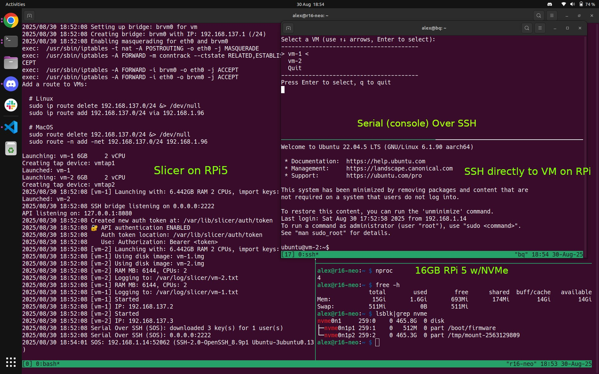

# Introduction to Slicer

[Slicer](https://slicervm.com) (aka SlicerVM) turns any machine into your own private microVM cloud using [Firecracker](https://firecracker-microvm.github.io/) or [Cloud Hypervisor](https://cloud-hypervisor.org/). It takes a low level, but powerful primitive and makes it accessible for humans, through a CLI, API and SDK.

Not only can you run applications like websites, databases, APIs, or Kubernetes clusters, you can also fully control a system programatically and from scripts - making it ideal for both long-running and short-lived jobs, AI agents, background jobs, bots, and CI runners.

You probably have what you need to try it out - a laptop, mini PC, old Intel NUC, or a Raspberry Pi 4/5 will do just fine. Bare-metal cloud from vendors like Hetzner make running Slicer in production, with a public IP, industrial-grade power, and reliable Internet connection a breeze.

It's ideal for learning & experimentation - and powerful enough for R&D, customer support, and even production workloads

Slicer was developed by our team for internal use before being released to the public.

*How we use Slicer at OpenFaaS Ltd*

* To boot up a Kubernetes cluster in ~ 1min (large or small) to test new versions of Helm charts
* To reproduce customer support tickets - sometimes running multiple environments at once
* For introducing chaos testing into Kubernetes - where the network can be turned off whilst retaining a shell
* For R&D with AI / LLM models in isolated environments
* Replacing slower cloud VMs with much faster hardware - desktop CPUs burst up to 5.5Ghz, have local NVMes
* Reducing cloud costs of R&D/permanent environments - using mini PCs, self-built servers, and bare-metal in the cloud i.e. Hetzner

*Where can you run it?*

When commodity cloud vendors charge ~ 200 USD / mo for as little as 8vCPU and 32GB of RAM, working at scale becomes prohibitively expensive. You can obtain a brand new mini PC, or used server from eBay for a similar amount as a one-off cost. Or pay a bare-metal cloud provider like Hetzner Robot 33-100 EUR / mo for a powerful server for a public IP with reliable power and Internet. If you're tied to the cloud - Slicer also runs on DigitalOcean, Azure and GCP via nested virtualisation.

> Slicer [is also fully functional on WSL2!](https://x.com/alexellisuk/status/1962785021976076322)

Learn more in Alex's blog post [Preview: Slice Up Bare-Metal with Slicer](https://blog.alexellis.io/slicer-bare-metal-preview/).

See initial customer interest via this [X/Twitter post](https://x.com/alexellisuk/status/1961752898552914074)

> Slicer running on a Raspberry Pi 5 with NVMe. Click above to watch the video.

## Target users for Slicer

### The learner, the experimenter - let's make VMs fun again

For the hobbyist, Slicer Home Edition is available at a low cost, making it accessible for personal projects and experimentation.

Take that N100, that Raspberry Pi 5, that Beelink that DDH made you buy, that Dell PowerEdge in your basement, that Mac Mini M1 that's gathering dust, and make it into your lab.

Slicer is probably the easiest, and most versatile way to learn about microVMs, virtualization and storage, whilst getting the most out of the hardware you already have your hands on.

You can have fun, whilst learning and experimenting. You could even set up a permanent K3s cluster with K3sup Pro which you'll get as a free add-on.

All at less than the cost of a weekly coffee.

Think of Slicer like your own fast and private AWS EC2 region, without the surprise bill because you left something running.

After running `slicer activate`, you'll get a link to join our Slicer Discord Server.

[Sign up now](https://slicervm.com/pricing)

## The power user and technologist of the team

For the power user or the technologist of the team, Slicer offers a quick and easy way to experiment with ideas and new technology in isolation, on fast hardware that you control.

Whether you work on a Kubernetes product, support customers who do, or are looking for a way to start experimenting with agentic flows, LLMs with GPU acceleration, or a way to get the absolute most out of a large bare-metal host, Slicer will get you there and fast.

The cost for commercial use starts at 250 USD / seat. A seat can be taken by a developer, or a production deployment on a server. For larger plans that scale for your needs, [contact us](https://slicervm.com/pricing) and we can set up a demo.

## Use-cases

### Super fast Kubernetes at large scale

Test at scale in minutes, not hours.

We had to reproduce a customer support case in Kubernetes which only happened at the transition between 7000 to 7001 Pods. The time to create a 3-node cluster on AWS EKS is approximately 30 minutes, without even thinking about all those nodes. With Slicer, we reduced the time to testing to single digit minutes.

What's more, the cluster can be destroyed near instantly, whilst CloudFormation hasn't even computed a plan yet.

### Chaos testing & customer support

When writing Kubernetes operators, failure conditions are often overlooked. And no, you don't need a special framework on the CNCF landscape to do this.

We had a controller that failed intermittently, and one day a customer gave us a log that pointed us in the right direction. The network was going down in AWS, and then its cached informers stopped - meaning it got no new events.

We used Slicer's Serial Over SSH console to connect to the machine running the leader-elected Pod, and take down the network, whilst watching the logs of the container on disk. Within a couple of minutes the issue was patched, and a new release was shipped to the customer.

### Great value production

The first way we deployed Slicer into a permanent setup was by taking a Hetzner host with a 8-core AMD Ryzen and 64GB of RAM, and local NVMe. We created a HA, 3-node K3s cluster capable of running 300 Pods and deployed our long term testing environments to it, later adding production workloads SaaS like Inlets Cloud - running them there instead of creating myriad of costs in AWS.

### GPU-powered AI and agentic workflows

Slicer isn't tied to Firecracker. With the Cloud Hypervisor support, any kind of Nvidia GPU from a 3060 RTX, to a 3090 RTX, to an A100 can be used run local LLMs using Ollama, or a tool of your choice.

Ephemeral VMs can be launched for agents via API, or command line - supplying a userdata script for bootstrap. You can then set up your own agent for command & control.

### Better than misusing containers

Docker is convenient and ubiquitous, it's totally the right option most of the time. But if you're having to give it all kinds of privileged flags just to make something work like Wireguard, or Docker In Docker, then you have the wrong tool for the job.

A microVM gives you an isolated guest Kernel. You can even build new modules and load them in for R&D, or for testing new frameworks based upon eBPF - all without compromising the host.

Our second production instance of Slicer has three VMs in its group: 1 hosts a Ghost blog using Docker, 2 hosts the control-plane for Actuated along with all its requisite storage and state, 3 hosts an OpenFaaS Edge instance running in containerd. Everything is completely isolated and portable.

## Next steps

* [Install Slicer](/getting-started/install) and get started today.
* [Read the launch blog post](https://blog.alexellis.io/slicer-bare-metal-preview/)
* [Get in touch](/contact) for a commercial demo or order
